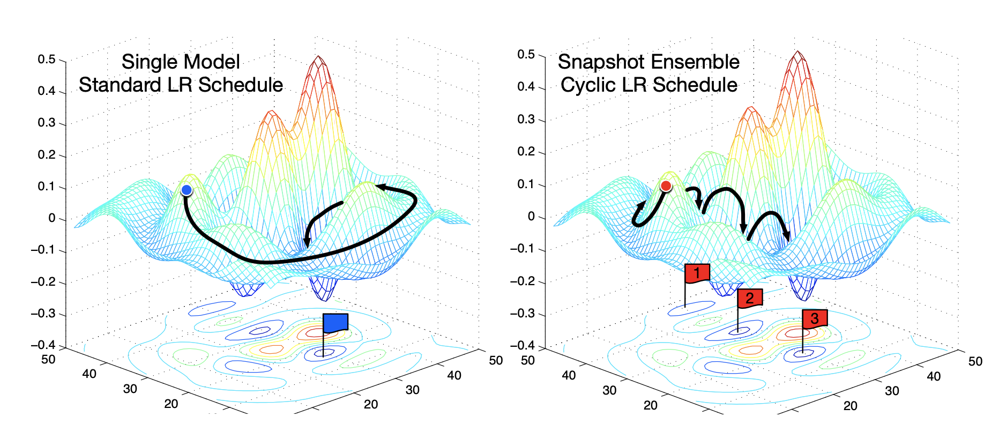

<p align="center">
  
</p>

<h1 align="center">
  SnapE-PyKEEN
</h1>

  <a href='https://opensource.org/licenses/MIT'>
    
  </a>

  <a href="https://zenodo.org/badge/latestdoi/242672435">
    
  </a>

  <a href="https://optuna.org">
    
  </a>

  <a href="https://pytorchlightning.ai">
    
  </a>

  <a href="https://github.com/psf/black">
    
  </a>

  <a href=".github/CODE_OF_CONDUCT.md">
    
  </a>
</p>

<p align="center">
    <b>SnapE-PyKEEN</b> (<b>S</b>napshot <b>E</b>nsembles - <b>P</b>ython <b>K</b>nowl<b>E</b>dge <b>E</b>mbeddi<b>N</b>gs) is a Python package adapted from PyKEEN to allow training and evaluating snapshot ensembles of knowledge graph embedding models. Additionally, it also includes an extended negative sampler that iteratively creates negative examples using previous snapshot models. All functionalities and components provided in PyKEEN are also available in SnapE-PyKEEN.
</p>

<p align="center">
  <a href="#introduction">Introduction</a> •
  <a href="#installation">Installation</a> •
  <a href="#training-a-snapshot-ensemble-of-kgems">Training a Snapshot Ensemble of KGEMs</a> •
  <a href="#extended-negative-sampler">Extended Negative Sampler</a> •
  <a href="#evaluating-a-snapshot-ensemble-of-kgems">Evaluating a snapshot ensemble of KGEMs</a> •
  <a href="#experimentation">Experimentation</a> 

</p>

## Introduction

SnapE - is an approach to transfer the idea of snapshot ensembles to link prediction models in knowledge graphs. Additionally, SnapE provides a training loop that iteratively creates negative examples using previous snapshot models. 

Snapshot Ensembling is a method proposed in 2017 by Huang et al to boost the performance of deep learning models without an increase in computational costs. It builds on the idea of training a model with cyclic learning rate annealing and storing snapshots of the model at the end of each cycle. The model converges to a local minimum at the end of each cycle then, by restarting the learning rate, the model escapes the local minimum and converges to another one. The resulting snapshots constitute a set of diverse base models. The stored snapshots can be ensembled which allows for training an ensemble of prediction models at the cost of training a single one. More information on Snapshot Ensembles can be found in [this paper](https://arxiv.org/abs/1704.00109).

<p align="center">
  
</p>


## Installation

SnapE-PyKEEN requires Python 3.8+. It can be downloaded
and installed directly from the
source code on [GitHub](https://github.com/Alishaba/pykeen-snapshot-ensembles) with:

```shell
pip install git+https://github.com/Alishaba/pykeen-snapshot-ensembles.git
```
More information about [PyKEEN](https://github.com/pykeen/pykeen) (e.g., installation, first steps, Knowledge Graph Embedding Models, extras) can be found in the [documentation](https://pykeen.readthedocs.io/en/latest/index.html).

SnapE-PyKEEN extends PyKEEN to allow for training Snapshot Ensembles of Knowledge Graph Embedding models by providing the following classes:
1. ModelSavingCallback: This class extends PyKEEN's  TrainingCallback class to perform cyclic learning rate annealing and store model snapshots at the end of each cycle. The current implementation stores the models in a folder "models" in the root directory. Snapshot names will have the format './models/trained_model_{dataset_name}\_{model_name}\_{method}_{epoch}.pkl' where method is a keyword needed to separate between different experiemnts and epoch is the number of epoch at which the snapshot was stored.
2. ExtendedBasicNegativeSampler: This class extends PyKEEN's NegativeSampler class to perform the extended negative sampling.
3. EnsembleRankBasedEvaluator: This class extends PyKEEN's EnsembleEvaluator class to perform a rank-based evaluation for ensembles of KGEMs. 


## Training a Snapshot Ensemble of KGEMs

Below is an example of how to use SnapE-PyKEEN to train a Snapshot Ensemble of Knowledge Graph embedding Models.

```python
from pykeen.datasets import FB15k237
from pykeen.models import TransE
from pykeen.pipeline import pipeline
from pykeen.training import ModelSavingCallback

# Get FB15k-237 dataset
dataset = FB15k237()

# Define model
model = TransE(
    triples_factory=dataset.training,
)

# Define the Snapshot Ensemble configuration
batch_size = 128
max_lr = 0.1 # the initial learning rate
num_epochs = 500
step = 50 # the number of epochs in each annealing cycle
num_snapshots=10 # the number of snapshots to store
dataset_name = 'FB15k237'
model_name = 'TransE'
method = 'paper'


# Train your model
pipeline_result = pipeline(
    dataset=dataset,
    random_seed=10,
    model=model,
    training_kwargs=dict(
      drop_last=True,
      num_epochs=num_epochs,
      callbacks=ModelSavingCallback,
      callback_kwargs=dict(
          batch_size=batch_size,
          dataset_size=dataset.training.num_triples,
          max_lr=max_lr,
          min_lr=None,
          step=step,
          num_snapshots=num_snapshots,
          num_epochs=num_epochs,
          method=method,
          dataset_name=dataset_name,
          model_name=model_name
      )
    )
)
```


## Extended Negative Sampler

Below is an example of how to use SnapE-PyKEEN to train a Snapshot Ensemble of Knowledge Graph embedding Models using the extended negative sampler.

```python
from pykeen.datasets import FB15k237
from pykeen.sampling import ExtendedBasicNegativeSampler
from pykeen.models import TransE
from pykeen.pipeline import pipeline
from pykeen.training import ModelSavingCallback
import math

# Get FB15k-237 dataset
dataset = FB15k237()

# Define model
model = TransE(
    triples_factory=dataset.training,
)

# Define the Snapshot Ensemble configuration
batch_size = 128
num_batches = math.floor(dataset.training.num_triples/batch_size)
models_to_load = 5
max_lr = 0.1
num_epochs = 500
step = 50
num_snapshots=10
dataset_name = 'FB15k237'
model_name = 'TransE'
method = 'paper'

# Define the configuraton of the extended negative sampler
negative_sampler_kwargs = dict(
  num_batches=num_batches,
  models_to_load=models_to_load,
  num_epochs=num_epochs,
  step=step,
  dataset_name=dataset_name,
  model_name=model_name,
  method=method,
)

# Train your model
pipeline_result = pipeline(
    dataset=dataset,
    random_seed=10,
    model=model,
    negative_sampler=ExtendedBasicNegativeSampler,
    negative_sampler_kwargs=negative_sampler_kwargs,
    training_kwargs=dict(
      drop_last=True,
      num_epochs=num_epochs,
      callbacks=ModelSavingCallback,
      callback_kwargs=dict(
          batch_size=batch_size,
          dataset_size=dataset.training.num_triples,
          max_lr=max_lr,
          min_lr=None,
          step=step,
          num_snapshots=num_snapshots,
          num_epochs=num_epochs,
          method=method,
          dataset_name=dataset_name,
          model_name=model_name
      )
    )
)
```


## Evaluating a snapshot ensemble of KGEMs

SnapE-PyKEEN provides rank-based evaluation for ensembles of Knowledge Graph Embedding Models.

The example below shows how to use EnsembleRankBasedEvaluator to evaluate an ensemble. In the example below, the scores are aggregated using a simple average (by default).

```python
from pykeen.datasets import FB15k237
from pykeen.sampling import ExtendedBasicNegativeSampler
from pykeen.evaluation import EnsembleRankBasedEvaluator
from pykeen.models import TransE
from pykeen.pipeline import pipeline
from pykeen.training import ModelSavingCallback
import math
import torch

# Get FB15k-237 dataset
dataset = FB15k237()

# Define model
model = TransE(
    triples_factory=dataset.training,
)

# Define the Snapshot Ensemble configuration
batch_size = 128
num_batches = math.floor(dataset.training.num_triples/batch_size)
models_to_load = 5
max_lr = 0.1
num_epochs = 500
step = 50
num_snapshots=10
dataset_name = 'FB15k237'
model_name = 'TransE'
method = 'paper'

# Define the configuraton of the extended negative sampler
negative_sampler_kwargs = dict(
  num_batches=num_batches,
  models_to_load=models_to_load,
  num_epochs=num_epochs,
  step=step,
  dataset_name=dataset_name,
  model_name=model_name,
  method=method,
)

# Train your model
pipeline_result = pipeline(
    dataset=dataset,
    random_seed=10,
    model=model,
    negative_sampler=ExtendedBasicNegativeSampler,
    negative_sampler_kwargs=negative_sampler_kwargs,
    training_kwargs=dict(
      drop_last=True,
      num_epochs=num_epochs,
      callbacks=ModelSavingCallback,
      callback_kwargs=dict(
          batch_size=batch_size,
          dataset_size=dataset.training.num_triples,
          max_lr=max_lr,
          min_lr=None,
          step=step,
          num_snapshots=num_snapshots,
          num_epochs=num_epochs,
          method=method,
          dataset_name=dataset_name,
          model_name=model_name
      )
    )
)

# Load the last m=models_to_load models to ensemble
models = [torch.load(f"./models/trained_model_{dataset_name}_{model_name}_{method}_{num_epochs - i * step}.pkl") for i in range(0, models_to_load)]

# Define evaluator
evaluator = EnsembleRankBasedEvaluator()

# Evaluate your model with not only testing triples,
# but also filter on training and validation triples
results = evaluator.evaluate(
    model=models,
    mapped_triples=dataset.testing.mapped_triples,
    additional_filter_triples=[
        dataset.training.mapped_triples,
        dataset.validation.mapped_triples,
    ],
)
```

Moreover, the scores of base models can be normalized and aggregated using weighted average. The example below shows how to pass weights and define a normalizer.

```python
from pykeen.datasets import FB15k237
from pykeen.sampling import ExtendedBasicNegativeSampler
from pykeen.evaluation import EnsembleRankBasedEvaluator
from pykeen.models import TransE
from pykeen.pipeline import pipeline
from pykeen.training import ModelSavingCallback
import math
import torch

# Get FB15k-237 dataset
dataset = FB15k237()

# Define model
model = TransE(
    triples_factory=dataset.training,
)

# Define the Snapshot Ensemble configuration
batch_size = 128
num_batches = math.floor(dataset.training.num_triples/batch_size)
models_to_load = 5
max_lr = 0.1
num_epochs = 500
step = 50
num_snapshots=10
dataset_name = 'FB15k237'
model_name = 'TransE'
method = 'paper'

# Define the configuraton of the extended negative sampler
negative_sampler_kwargs = dict(
  num_batches=num_batches,
  models_to_load=models_to_load,
  num_epochs=num_epochs,
  step=step,
  dataset_name=dataset_name,
  model_name=model_name,
  method=method,
)

# Train your model
pipeline_result = pipeline(
    dataset=dataset,
    random_seed=10,
    model=model,
    negative_sampler=ExtendedBasicNegativeSampler,
    negative_sampler_kwargs=negative_sampler_kwargs,
    training_kwargs=dict(
      drop_last=True,
      num_epochs=num_epochs,
      callbacks=ModelSavingCallback,
      callback_kwargs=dict(
          batch_size=batch_size,
          dataset_size=dataset.training.num_triples,
          max_lr=max_lr,
          min_lr=None,
          step=step,
          num_snapshots=num_snapshots,
          num_epochs=num_epochs,
          method=method,
          dataset_name=dataset_name,
          model_name=model_name
      )
    )
)

# Load the last m=models_to_load models to ensemble
models = [torch.load(f"./models/trained_model_{dataset_name}_{model_name}_{method}_{num_epochs - i * step}.pkl") for i in range(0, models_to_load)]

# Define the weights. Weights will be normalized.
weights = [models_to_load - i for i in range(0,models_to_load)]

# Define wether to calculate Borda ranks
borda = True

# Define which normalizer to use out of ['MinMax', 'Standard', None]
normalize = 'MinMax'

# Define evaluator
evaluator = EnsembleRankBasedEvaluator()

# Evaluate your model with not only testing triples,
# but also filter on training and validation triples 
results = evaluator.evaluate(
    model=models,
    mapped_triples=dataset.testing.mapped_triples,
    additional_filter_triples=[
        dataset.training.mapped_triples,
        dataset.validation.mapped_triples,
    ],
    weights=weights, 
    borda=borda, 
    normalize=normalize
)
```


## Experimentation

We used SnapE-PyKEEN to perform a benchmarking study: We ran experiments with SnapE and four different base
models and compared them to the results achieved with the respective baseline models. In our evaluation, we consider two different setups:
1. Equal training time budget. We train a model with 𝑑 dimensions and 𝑚 snapshots, and compare it to a single base model with 𝑑 dimensions.
2. Equal memory budget. We train a model with 𝑑/𝑚 dimensions and 𝑚 snapshots, and compare it to a single base model with 𝑑 dimensions.

Additionally, we run an Ablation study to analyze the impact of:
1. different optimizers.
2. different learning rate schedulers (CCA and MMCCLR).
3. different negative samplers.
4. different strategies for combining the predictions of the snapshots.

All results are available in the two links below:
1. Experiemnts ran with Max-Min Cosine Cyclic Learning Rate - [Snapshot Ensembles with MMCCLR](https://docs.google.com/spreadsheets/d/1OfpnbTxGLBjt0vi2xPCrTmphyUnQePn9NQYYZ_m29ws/edit?usp=sharing)
2. Experiemnts ran with Cosine Cyclic Annealing - [Snapshot Ensembles with CCA](https://docs.google.com/spreadsheets/d/1reAZlNv2ywucMc8frlGwghCsM69CtJ1T1pAbOVrcsko/edit?usp=sharing)
